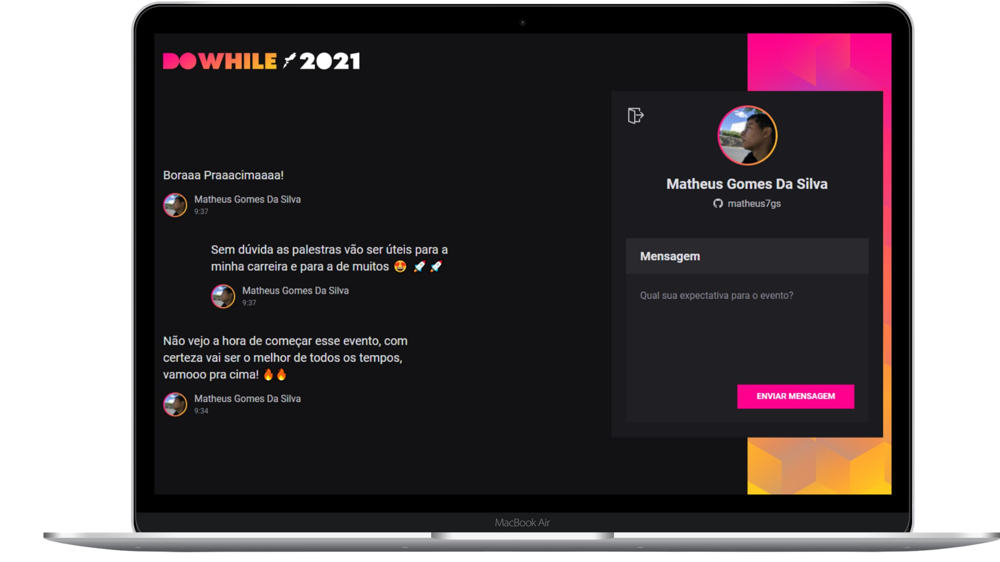

<h1 align="center">NLW Heat - React.js</h1>

  <a href="#-tecnologias">Tecnologias</a>&nbsp;&nbsp;&nbsp;|&nbsp;&nbsp;&nbsp;
  <a href="#-projeto">Projeto</a>&nbsp;&nbsp;&nbsp;|&nbsp;&nbsp;&nbsp;
  <a href="#-como-executar">Como executar</a>&nbsp;&nbsp;&nbsp;|&nbsp;&nbsp;&nbsp;
  <a href="#-layout">Layout</a>&nbsp;&nbsp;&nbsp;|&nbsp;&nbsp;&nbsp;
  <a href="#-licença">Licença</a>

  
  

  

## 🚀 Tecnologias

Esse projeto foi desenvolvido com as seguintes tecnologias:

- React
- TypeScript
- HTML
- Vite
- Sass
- Socket.io

## 💻 Projeto

React - NLW Heat é uma aplicação web de troca de mensagens, para o DoWhile 2021.

## 👨‍💻 Como executar

- Clone o repositório e acesse a pasta;
- Instale as dependências com `yarn`;
- Inicie o projeto com `yarn dev`;

## Layout

Você pode visualizar o layout do projeto através [desse link](<https://www.figma.com/community/file/1031699316177416916/%5BNLW-Heat---Mission%3A-Impulse%5D-DoWhile2021>). É necessário ter conta no [Figma](https://figma.com) para acessá-lo.

## 📄 Licença

Esse projeto está sob a licença MIT. Veja o arquivo [LICENSE](LICENSE) para mais detalhes.

---

Feito com ❤ by Matheus Gomes 👋🏻
